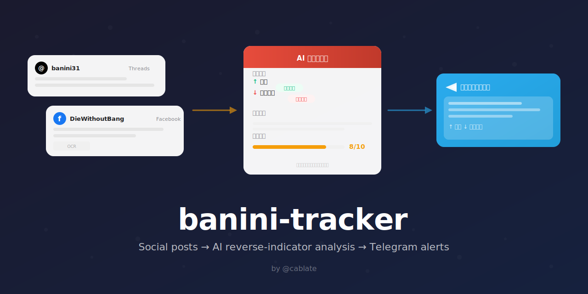

<p align="center">
  
</p>

# banini-tracker

追蹤「股海冥燈」巴逆逆（8zz）的社群貼文 CLI 工具。

透過 Apify 抓取 Threads / Facebook 貼文，讓 AI（Claude / GPT / 任何 LLM）進行反指標分析，結果推送到 Telegram。

## 安裝

```bash
# 不需安裝，npx 直接用
npx banini-tracker --help

# 或全域安裝
npm install -g banini-tracker
```

## 快速開始

```bash
# 1. 初始化設定
npx banini-tracker init \
  --apify-token YOUR_APIFY_TOKEN \
  --tg-bot-token YOUR_TG_BOT_TOKEN \
  --tg-channel-id YOUR_TG_CHANNEL_ID

# 2. 抓取 Facebook 最新 3 篇貼文
npx banini-tracker fetch -s fb -n 3 --mark-seen

# 3. 推送分析結果到 Telegram
npx banini-tracker push -m "分析結果..."
```

## 指令

| 指令 | 說明 |
|------|------|
| `init` | 初始化設定檔（`~/.banini-tracker.json`） |
| `config` | 顯示目前設定 |
| `fetch` | 抓取貼文，輸出 JSON 到 stdout |
| `push` | 推送訊息到 Telegram |
| `seen list` | 列出已讀貼文 ID |
| `seen mark <id...>` | 標記貼文為已讀 |
| `seen clear` | 清空已讀紀錄 |

### fetch 選項

```
-s, --source <source>  來源：threads / fb / both（預設 fb）
-n, --limit <n>        每個來源抓幾篇（預設 3）
--no-dedup             不去重
--mark-seen            輸出後自動標記已讀
```

### push 選項

```
-m, --message <text>     直接帶訊息
-f, --file <path>        從檔案讀取
--parse-mode <mode>      HTML / Markdown / none（預設 HTML）
```

不帶 `-m` 或 `-f` 時從 stdin 讀取。

## 搭配 Claude Code 使用

在 Claude Code 的 skill 中使用，Claude 自己就是分析引擎：

1. `fetch` 抓貼文 → Claude 讀 JSON
2. Claude 分析 + WebSearch 查最新走勢
3. Claude 組報告 → `push` 推送 Telegram

詳見 [`skill/SKILL.md`](skill/SKILL.md)。

## 常駐排程模式（Docker 部署）

除了 CLI 模式，也可以用 Docker 部署為常駐服務，自動排程抓取 + LLM 分析 + Telegram 推送。

```bash
# 1. 複製 .env
cp .env.example .env
# 填入 APIFY_TOKEN, LLM_BASE_URL, LLM_API_KEY, LLM_MODEL, TG_BOT_TOKEN, TG_CHANNEL_ID

# 2. Docker 部署
docker build -t banini-tracker .
docker run -d --name banini --env-file .env banini-tracker

# 3. 或本地直接跑
npm install && npm run start
```

**排程規則**：
- 盤中（週一~五 09:00-13:30）：每 30 分鐘，FB only 抓 1 篇
- 盤後（每天 23:00）：Threads + FB 各 3 篇

**手動模式**：
```bash
npm run dev              # 單次執行（Threads + FB 各 3 篇）
npm run dry              # 只抓取不分析
npm run market           # 盤中模式（FB only, 1 篇）
npm run evening          # 盤後模式（各 3 篇）
```

## 費用

| 來源 | 每次費用 | 說明 |
|------|---------|------|
| Facebook | ~$0.02 | CU 計費，便宜 |
| Threads | ~$0.15 | Pay-per-event，較貴 |

## 設定檔

`~/.banini-tracker.json`：

```json
{
  "apifyToken": "apify_api_...",
  "telegram": {
    "botToken": "123456:ABC...",
    "channelId": "-100..."
  },
  "targets": {
    "threadsUsername": "banini31",
    "facebookPageUrl": "https://www.facebook.com/DieWithoutBang/"
  }
}
```

## 免責聲明

本專案僅供娛樂參考，不構成任何投資建議。

## License

MIT
